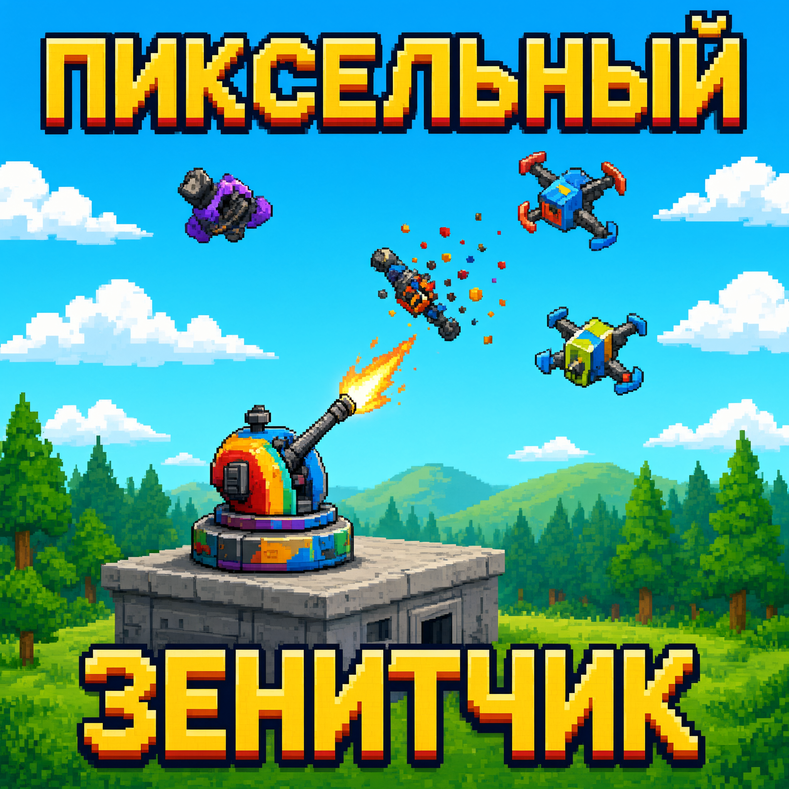

# Пиксельный Зенитчик

> Пиксельная аркада для Android: защити базу от роя автономных дронов.

«Пиксельный Зенитчик» — мобильная игра в стиле ретро-аркад, где игрок берёт под контроль стационарную зенитную установку и отражает атаки дронов. Основная цель — не позволить противникам прорваться к защищаемому объекту.

Версия 0.1.0 — **бесплатная**, без рекламы и встроенных покупок: доступен весь игровой контент. Платные возможности планируются отдельным этапом.



## Сюжет

В недалёком будущем автономная система управления дронами выходит из-под контроля. Над последними защищёнными базами появляется Рой — сеть машин, атакующая с воздуха.

Игрок становится оператором установки «Зенит-7». Нужно пережить волны атак, защитить энергоядро базы, улучшить вооружение и добраться до источника сигнала, управляющего Роем.

## Особенности

- Пиксельная графика в стиле 8-bit / 16-bit (16-цветная палитра, целочисленный масштаб)
- Простое управление одной рукой: тап по цели = выстрел
- Короткие динамичные игровые сессии
- Волны дронов с разными характеристиками
- Улучшение зенитной установки между волнами
- Несколько типов боеприпасов и способностей (EMP, криоснаряды, ракеты)
- Боссы каждую пятую волну
- Бесконечный режим обороны (волны не заканчиваются, растёт сложность)
- Локализация на русском языке
- Поддержка Android
- Игра не требует интернета и не собирает персональные данные

## Геймплей

Игрок управляет зенитной турелью в нижней части экрана:

- Находит и уничтожает воздушные цели
- Не допускает прорыва дронов к базе
- Зарабатывает очки за сбитые цели (серия попаданий даёт множитель до x5)
- Выбирает одно из трёх улучшений между волнами
- Использует EMP-импульс в критические моменты
- Сражается с усиленными дронами и боссами

## Типы противников

| Противник | Особенность |
|---|---|
| Разведчик | Медленный базовый дрон |
| Перехватчик | Быстро меняет траекторию |
| Бронированный дрон | Требует нескольких попаданий |
| Дрон-роевик | Появляется группами |
| Маскировщик | Временно скрывается на фоне неба |
| Дрон-матка | Босс каждую 5-ю волну, выпускает малые дроны |

## Улучшения

- Урон основного орудия
- Скорострельность
- Скорость поворота турели
- Шанс критического попадания
- Радиус взрыва
- Ёмкость магазина и скорость перезарядки
- EMP-импульс
- Замораживающие снаряды
- Ракетный залп
- Автоматический дрон-перехватчик
- Ремонт ядра базы

## Управление

- Тап по экрану — наведение и выстрел по точке касания
- Перетаскивание — наведение без выстрела
- Кнопка «ПЕРЕЗАРЯДКА» — заполнить обойму досрочно
- Кнопка «EMP» — импульс, когда шкала заряда заполнена
- Кнопка паузы — приостановить бой (игра также встаёт на паузу при сворачивании)
- Экран улучшений — между волнами

## Технологии

- **Flutter** (Dart 3) — единый код, сборка APK/AAB для Android
- Вся графика рисуется кодом: спрайты описаны «картой символов», как `pyxel.images.set()` в Pyxel
- 16-цветная палитра, виртуальное разрешение 180 x ~400 и целочисленное масштабирование — пиксель всегда квадратный
- Единственная внешняя зависимость — `shared_preferences` (рекорд и настройки). Ассетов кроме логотипа нет

Вдохновение и заимствованные приёмы: движок [Pyxel](https://github.com/kitao/pyxel) (16 цветов, фиксированное разрешение, спрайты-карты символов, сценовая структура из примера `09_shooter.py`). Pyxel распространяется под MIT License.

## Структура проекта

```
lib/
  main.dart                 точка входа, ориентация, тема
  engine/
    game.dart               движок: сцены, волны, стрельба, урон, EMP
    drone.dart              типы дронов и их поведение
    effects.dart            снаряды, взрывы, частицы, всплывающий текст
    upgrades.dart           список улучшений
    sprites.dart            спрайты-«карты символов»
    palette.dart            16-цветная палитра
    pixels.dart             пиксельные примитивы (rect, circle, ring, line)
    view_transform.dart     экран -> виртуальные пиксели
    signal.dart             минимальный ChangeNotifier
  ui/
    game_screen.dart        цикл кадров, ввод, слои интерфейса
    pixel_view.dart         отрисовка мира и HUD
    overlays.dart           меню, улучшения, финал, пауза, кнопки боя
  services/
    storage.dart            рекорд и настройки
    sfx.dart                системный звук и вибрация
test/
  game_test.dart            тесты игровой логики
build_apk.ps1 / .bat        сборка APK/AAB
RUSTORE.md                  инструкция по публикации
```

## Сборка APK

Требуется [Flutter SDK](https://docs.flutter.dev/get-started/install/windows) 3.16+ и Android SDK (обычно ставятся вместе с Android Studio). Проверка окружения:

```bash
flutter doctor
```

Папки `android/` в репозитории нет намеренно: её создаёт скрипт сборки через `flutter create`, поэтому проект не зависит от версии шаблона Gradle.

### Быстрый старт

Windows (PowerShell):

```powershell
pwsh -File build_apk.ps1 -InitAndroid -Icons
```

Двойным щелчком: `build_apk.bat` (то же самое без иконок; для первого запуска удобнее `build_apk.bat -InitAndroid -Icons`).

Ручная сборка теми же шагами:

```bash
flutter create --platforms=android --org com.suslin --project-name pixel_zenitchik .
flutter pub get
flutter build apk --release            # build/app/outputs/flutter-apk/app-release.apk
flutter build appbundle --release      # build/app/outputs/bundle/release/app-release.aab
```

Установка на устройство:

```bash
adb install -r build/app/outputs/flutter-apk/app-release.apk
```

По умолчанию release-сборка подписывается debug-ключом (шаблон Flutter). Для публикации в RuStore нужен свой ключ: создайте его флагом `-NewKeystore` и подключите подпись — пошагово описано в [RUSTORE.md](RUSTORE.md).

## Тесты

```bash
flutter test
```

## Статус проекта

Проект находится в активной разработке. Функции, баланс, визуальный стиль и состав уровней могут изменяться.

## Планы

- [x] Базовая стрельба и система попаданий
- [x] Волны противников
- [x] Система здоровья базы
- [x] Улучшения между волнами
- [x] Несколько типов дронов
- [x] Боссы
- [x] Бесконечный режим
- [x] Таблица рекордов (локальный рекорд)
- [ ] Звуки и пиксельная музыка
- [x] Сборка APK для Android
- [ ] Публикация в RuStore
- [ ] Платные возможности (после релиза бесплатной версии)

## Лицензия

MIT License — см. [LICENSE](LICENSE). Copyright (c) 2026 Vitaliy Suslin.
